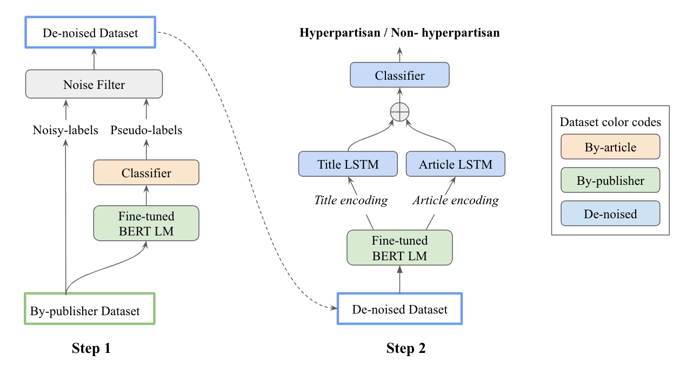

# Hyperpartisan-News-Detection
 [](https://opensource.org/licenses/MIT) 


This repository is for the paper in SemEval 2019 Task 4: Hyperpartisan News Detection ([Hyperpartisan News Detection by de-noising weakly-labeled data](https://www.aclweb.org/anthology/S19-2184))

This code has been written using PyTorch >= 0.4.1. If you find our idea or the resources in this repository very useful, please cite the following paper. The bibtex is listed below:
<pre>
@inproceedings{lee-etal-2019-team,
    title = "Team yeon-zi at {S}em{E}val-2019 Task 4: Hyperpartisan News Detection by De-noising Weakly-labeled Data",
    author = "Lee, Nayeon  and
      Liu, Zihan  and
      Fung, Pascale",
    booktitle = "Proceedings of the 13th International Workshop on Semantic Evaluation",
    month = jun,
    year = "2019",
    address = "Minneapolis, Minnesota, USA",
    publisher = "Association for Computational Linguistics",
    url = "https://www.aclweb.org/anthology/S19-2184",
    pages = "1052--1056",
    abstract = "This paper describes our system that has been submitted to SemEval-2019 Task 4: Hyperpartisan News Detection. We focus on removing the noise inherent in the hyperpartisanship dataset from both data-level and model-level by leveraging semi-supervised pseudo-labels and the state-of-the-art BERT model. Our model achieves 75.8% accuracy in the final by-article dataset without ensemble learning.",
}
</pre>

## Abstract
This paper describes our system that has been submitted to SemEval-2019 Task 4: Hyperpartisan News Detection. We focus on removing the noise inherent in the hyperpartisanship dataset from both data-level and model-level by leveraging semi-supervised pseudo-labels and the state-of-the-art BERT model. Our model achieves 75.8% accuracy in the final by-article dataset without ensemble learning.

## Model Architecture


## Getting Started
The following scripts describe how to train and test our model. This repository also contains character based feature and url based feature for further research.

### Fine-tune BERT Language Model
We fine-tune BERT language model on the large amount of hyperpartisan news dataset. 

First, process hyperpartisan news dataset.
```
python process_data_for_bert_training.py
```

Second, use processed hyperpartisan news articles to train BERT language model. 

(run_lm_finetuning.py comes from https://github.com/huggingface/pytorch-pretrained-BERT)
```
python run_lm_finetuning.py --train_file=data_new/article_corpus.txt --output_dir=bert_model --bert_model=bert-base-uncased --do_train --on_memory
```

### Train our model
The following scripts describe the two steps shown in the **architecture**.

#### Step1: Train BERT + Classifier for denoising
Use by-article data to train Classifier (BERT LM model is freezed) for denoising by-publisher data
```
python main --do_train --use_bert --batch_size=16
```

#### Step2: Train BERT + LSTM + Classifier by denoised by-publisher data
```
python main.py --do_train --train_cleaner_dataset --hidden_dim=300 --hidden_dim_tit=100 --batch_size=16 --weight_decay=1e-6
```

### Test our model
#### Test model on by-article data
```
python main.py --do_eval_bert_plus_lstm --train_cleaner_dataset --hidden_dim=300 --hidden_dim_tit=100 --batch_size=16 
```

